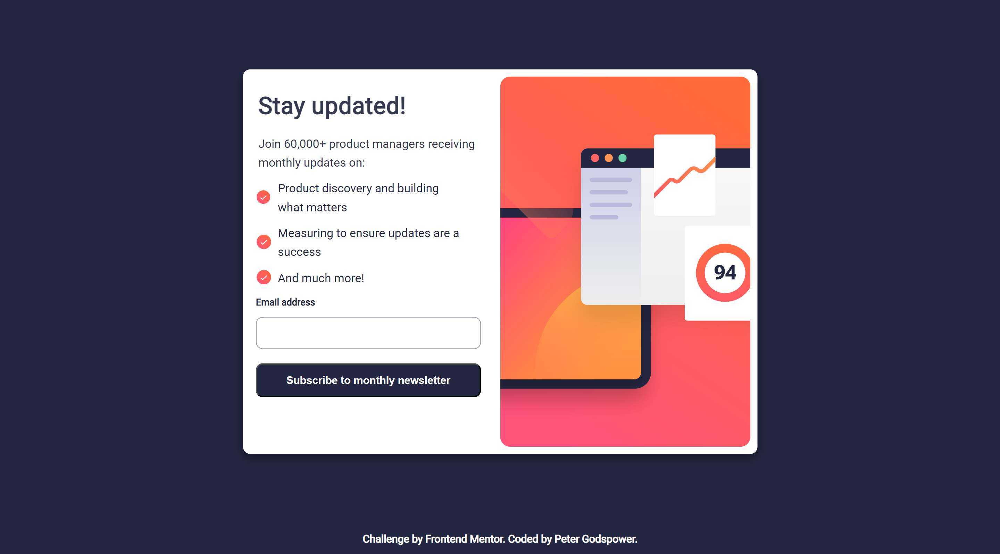
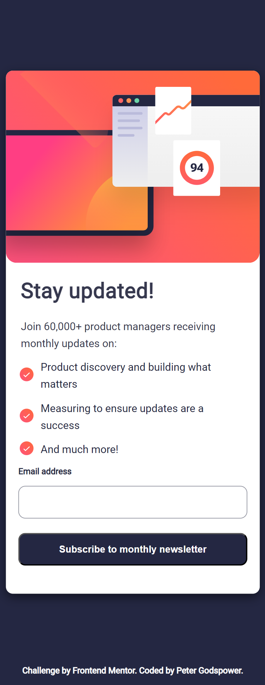

# Frontend Mentor | Newsletter Sign-Up Form with Success Message

This is a solution to the Newsletter Sign-Up Form with Success Message challenge on Frontend Mentor. The project involves creating a responsive and visually appealing newsletter sign-up form that displays a success message upon successful subscription.

## Table of Contents

- [Overview](#overview)
  - [Screenshot](#screenshot)
  - [Links](#links)
- [My Process](#my-process)
  - [Built With](#built-with)
  - [What I Learned](#what-i-learned)
  - [Continued Development](#continued-development)
  - [Useful Resources](#useful-resources)
- [Author](#author)
- [Acknowledgments](#acknowledgments)

## Overview

### Screenshot

### Links

- Solution URL: [Frontend Mentor Solution](https://www.frontendmentor.io/solutions/newsletter-sign-up-form-success-message)
- Live Site URL: [Live Demo](https://your-live-site-url.com)

## My Process

I approached this project by focusing on creating a responsive and interactive newsletter sign-up form with clear user feedback.

### Built With

- Semantic HTML5 markup
- CSS custom properties for theming
- Flexbox and Grid for layout management
- Responsive design using `clamp()` and viewport-relative units (vw)
- Custom fonts - "Roboto" for typography
- JavaScript for form validation and dynamic state management

### What I Learned

This project reinforced my knowledge in:

- **Responsive Design:** Creating fluid layouts and adaptive designs using modern CSS techniques.
- **CSS Variables:** Using custom properties for a consistent design theme and easy maintenance.
- **JavaScript Interactivity:** Implementing form validation and state transitions for user feedback.
- **UI/UX Best Practices:** Ensuring a smooth user experience with timely feedback and clear error messages.

### Continued Development

Future projects will focus on:

- **Advanced CSS Techniques:** Exploring CSS Grid for more complex layouts and animations.
- **JavaScript Enhancements:** Adding more advanced form handling and interactive features.
- **Accessibility & SEO:** Improving accessibility practices and search engine optimization for better user reach.

### Useful Resources

- [MDN Web Docs](https://developer.mozilla.org/en-US/) - Comprehensive documentation for web development.
- [CSS-Tricks](https://css-tricks.com/) - Tutorials and articles on modern CSS techniques.
- [Frontend Mentor](https://www.frontendmentor.io/) - Challenges and community support for frontend development.

## Author

- **Frontend Mentor:** [@Peter Godspower](https://www.frontendmentor.io/profile/TheBeyonder616)
- **GitHub:** [TheBeyonder616](https://github.com/TheBeyonder616)

## Acknowledgments

I would like to thank Frontend Mentor for this engaging challenge and the community for its valuable feedback and support.
